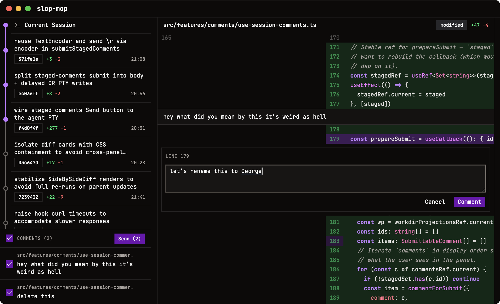

# 🪣🧹 Slop Mop

**An agentic programming tool for engineers who still care about the code.**

Slop Mop is a code review tool for working synchronously (ish) with agents, rather than asynchronously with colleagues.

Slop Mop is a small wrapper around Claude Code, implementing a specific workflow.
1. **🪣 The slop:** the robot does the robot thing.
2. Automatically make a git commit after each prompt
3. View a diff of the last prompt, or a range of prompts (it's just git, after all).
4. Review the diff, and leave comments as you go.
5. **🧹 The mop:** Send your comments all at once or in smaller batches, depending on how your agent works best.
6. goto 1



For now, this only supports Claude Code. Getting the robot to add support for other agent harnesses is probably pretty doable though. Also fair warning: this thing is _pure slop_. It has not been mopped. It's entirely unreviewed agent produced nonsense and might do something horrible. I've been finding it pretty useful though!

## Prerequisites

- [Node.js](https://nodejs.org/) v22+ (managed via `nodenv`)
- [pnpm](https://pnpm.io/) v8+
- [Rust](https://rustup.rs/) stable (1.85+)
- macOS system dependencies are bundled via Tauri/Xcode — no extra steps needed

## Setup

```sh
pnpm install
```

## Development

Run the full Tauri desktop app (starts Vite dev server + native window):

```sh
pnpm dev
```

Run the frontend only in a browser (no Rust backend):

```sh
pnpm dev:vite
```

## Scripts

| Script            | What it does                              |
| ----------------- | ----------------------------------------- |
| `pnpm dev`        | Launch Tauri app in development mode      |
| `pnpm dev:vite`   | Start Vite dev server (frontend only)     |
| `pnpm build`      | TypeScript check + Vite production build  |
| `pnpm tauri:build` | Build distributable Tauri app            |
| `pnpm typecheck`  | Run TypeScript compiler (no emit)         |
| `pnpm check`      | Run Biome linter + formatter              |
| `pnpm check:fix`  | Run Biome with auto-fix                   |

## Tech Stack

- **Desktop**: Tauri v2 (Rust backend, webview frontend)
- **Frontend**: React 19, TypeScript 5.9 (strictest config), Tailwind CSS v4
- **Build**: Vite 7 + SWC
- **Lint/Format**: Biome 2
- **Package manager**: pnpm

## Project Structure

```
src/                         # Frontend (TypeScript/React)
  app.tsx                    # Root component
  main.tsx                   # Entry point
  index.css                  # Tailwind import

src-tauri/                   # Backend (Rust/Tauri)
  src/
    main.rs                  # Desktop entry point
    lib.rs                   # Tauri app setup + commands
  Cargo.toml
  tauri.conf.json            # Tauri configuration
  capabilities/              # Tauri v2 permissions
  icons/                     # App icons (all platforms)
```

See [CLAUDE.md](./CLAUDE.md) for architecture details, conventions, and coding
standards.
